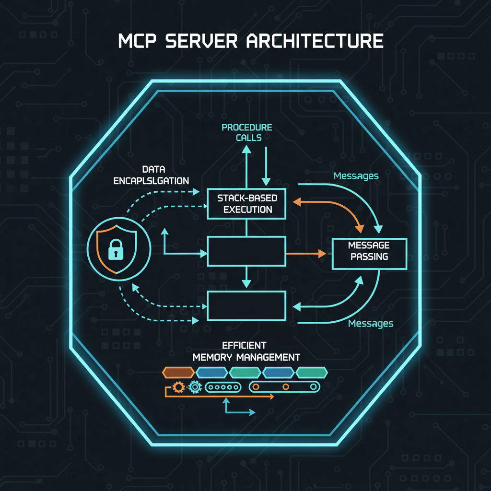
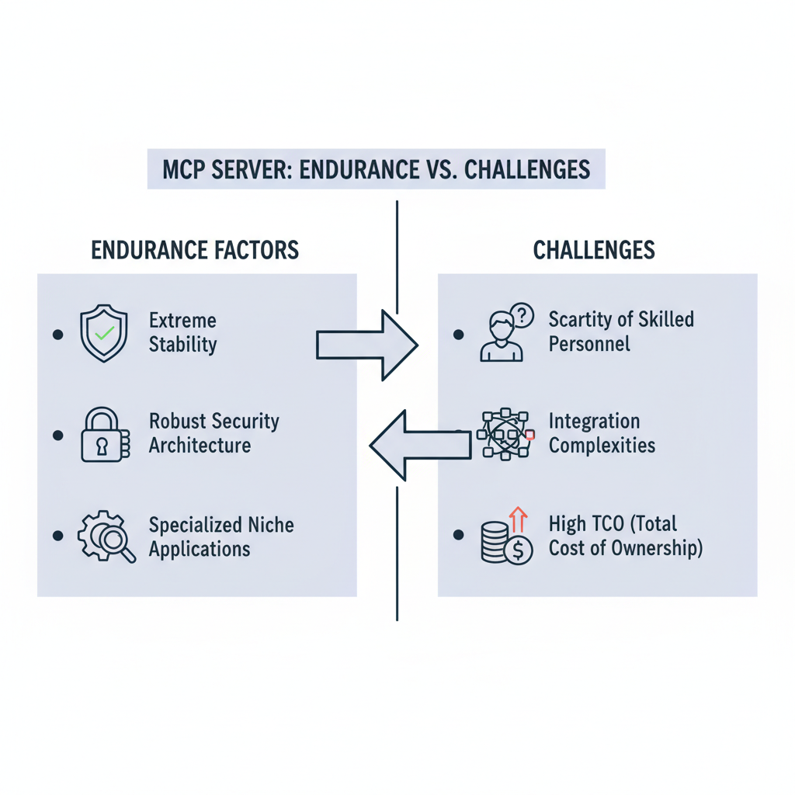
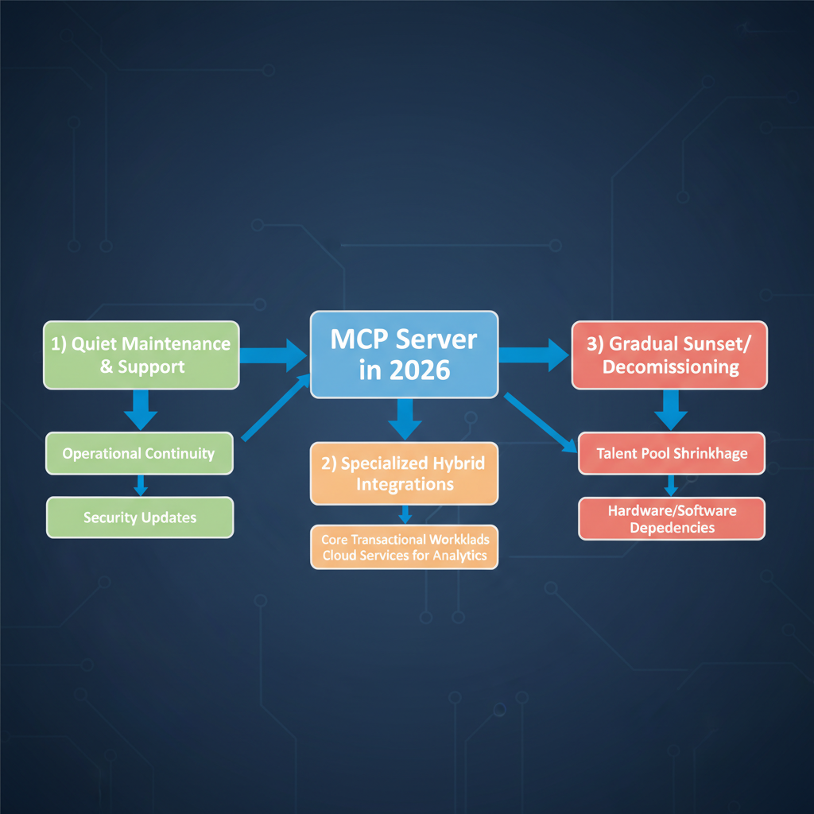

# MCP Server in Early 2026: A Quiet Legacy or Undergoing a Resurgence?

## Introduction: The Enduring Mystery of MCP Server

In an IT landscape increasingly dominated by cloud-native architectures, microservices, and AI, certain foundational technologies continue to operate, often out of the public spotlight. Among these is the MCP Server, a cornerstone of specialized enterprise computing that has quietly powered critical operations for decades. While not a household name in the broader tech community, its enduring presence within specific sectors makes it a fascinating subject for ongoing observation.

This 2026 check-in isn't a typical news roundup brimming with product launches or major strategic shifts. Instead, it's an acknowledgment of MCP Server's unique status as a robust legacy system that, by its very nature, generates little public 'news.' Its stability and specialized applications mean it rarely makes headlines, yet it remains a vital component for many organizations.

Our objective here is to delve beyond the absence of recent announcements. We aim to assess MCP Server's current relevance, explore the implications of its quiet but persistent operation, and consider what its enduring mystery means for developers, IT professionals, and system architects navigating both established and emerging technologies.

## A Brief History and Core Principles of MCP Server

The Master Control Program (MCP) Server is the foundational operating system for Unisys ClearPath mainframes, tracing its lineage back to the Burroughs Corporation in the early 1960s. It stands as one of the longest-lived operating systems still in active use, a testament to its robust design and enduring relevance in specialized niches.

What sets MCP Server apart are its unique architectural principles. From its inception, it embraced a stack-based design, which inherently supported high-level languages like ALGOL and later COBOL, and facilitated efficient procedure calls and memory management. Furthermore, the MCP exhibited early object-oriented characteristics, integrating concepts like data encapsulation and message passing long before they became mainstream in general computing. This deep integration of hardware and software was designed for optimal performance and integrity.

*Figure 1: Core Architectural Principles of the MCP Server.*

Traditionally, MCP Server has been the backbone for mission-critical enterprise environments demanding unparalleled reliability, security, and transaction processing capabilities. Its applications span across sectors such as financial services, government, and airlines, where continuous availability and data integrity are paramount, making it a quiet, yet powerful, workhorse in specialized computing domains.

## The Current Landscape: Where Does MCP Server Stand in 2026?

As we navigate early 2026, the broader IT ecosystem continues its relentless drive towards modernization and cloud adoption. Across industries, organizations are actively migrating legacy systems to contemporary platforms, refactoring monolithic applications into microservices, and embracing hybrid or public cloud infrastructures to enhance agility, scalability, and cost-efficiency. This overarching trend impacts nearly every corner of enterprise computing, pushing older, specialized systems to either evolve or recede into increasingly niche roles.

Against this backdrop, the public profile of MCP Server remains remarkably quiet. As of February 2026, there have been no recent major press releases, significant product updates, or public announcements from Unisys specifically detailing new developments or strategic shifts concerning MCP Server. This absence of fanfare is notable in an industry accustomed to frequent product cycles and marketing campaigns.

This quietude, however, does not necessarily signify obsolescence. Instead, it strongly suggests MCP Server continues to operate within highly specialized, critical environments where stability, proven reliability, and deep integration outweigh the need for public visibility or rapid iteration. These are often sectors like financial services, government, or critical infrastructure, where the systems manage core operations and are deeply embedded, making wholesale replacement a complex, high-risk, and costly endeavor. Such environments typically prioritize continuous, stable operation over public announcements, ensuring the quiet legacy of MCP Server persists in the background of global operations.

## Why MCP Server Endures (or Fades Quietly)

In 2026, the MCP Server continues to occupy a unique, often unseen, position in the enterprise landscape. Its enduring presence in some organizations is largely attributable to a few critical factors. Foremost among these is its extreme stability; these systems are renowned for their rock-solid reliability, boasting uptime metrics that often exceed modern platforms and providing an unwavering backbone for mission-critical operations. Coupled with this is an inherent security architecture, designed in an era with different threat models, which has proven remarkably robust against many contemporary vulnerabilities when properly maintained and isolated. Furthermore, MCP Server often underpins highly specialized applications in niche industries, where its unique capabilities and decades of tailored development make it difficult, if not impossible, to replace without significant disruption.

*Figure 2: Factors Contributing to MCP Server's Endurance vs. Key Challenges.*

However, this longevity comes with its own set of formidable challenges. The most pressing is the scarcity of skilled personnel proficient in its unique operating environment and programming languages. As the original developers retire, the pool of available experts shrinks, increasing maintenance costs and creating knowledge gaps. Organizations also grapple with integration complexities; connecting a mainframe-era system to modern cloud-native services, APIs, and data lakes can be a costly and intricate endeavor. This often contributes to a perceived high total cost of ownership, even if the system itself runs efficiently.

Ultimately, the continued operation of MCP Server in many environments boils down to the pragmatic "if it ain't broke, don't fix it" mentality. For systems deeply embedded in core business processes, performing flawlessly for decades, the monumental risk, cost, and disruption associated with migration often far outweigh the perceived benefits of modernization. Until a compelling business case for replacement emerges, many organizations opt for the quiet, stable legacy over the uncertain path of transformation.

## Potential Future Outlooks: Niche Evolution or Gradual Sunset?

As MCP Server quietly continues its operation for a dedicated user base, its future trajectory in the coming years presents a nuanced picture. The most probable immediate outlook involves the continuation of quiet maintenance and essential support for existing mission-critical customers. For organizations deeply invested in its proven stability and reliability, the focus remains squarely on operational continuity, with vendors likely providing necessary patches, security updates, and technical assistance to safeguard these long-standing, often unseen, implementations.

*Figure 3: Potential Future Trajectories for MCP Server.*

However, this doesn't preclude a degree of evolution. A pragmatic future could see MCP Server engaging in highly specialized integrations or 'hybrid' approaches. This strategy would allow core MCP applications to continue handling their primary, high-volume transactional workloads, while leveraging modern cloud services or data platforms for peripheral functions like advanced analytics, reporting, or external data exchange. Such integrations aim to extend the value and reach of existing investments without the disruptive overhaul of the stable core, enabling selective modernization at the edges of the enterprise architecture.

Looking further ahead, the long-term outlook must grapple with significant challenges. A shrinking talent pool, as experienced professionals retire, poses an increasing hurdle for maintenance, development, and troubleshooting, potentially driving up operational costs. Furthermore, the evolving landscape of hardware and software dependencies presents a persistent threat. As underlying infrastructure ages and new security paradigms emerge, maintaining compatibility and compliance for a specialized, legacy system becomes an ever-greater challenge, which could ultimately necessitate more aggressive sunsetting strategies for some organizations.

## Conclusion: A Testament to Reliability (or a Call to Action)

As we look at MCP Server in early 2026, its story isn't one of daily headlines or disruptive innovation. Instead, its continued presence is a testament to its foundational reliability. While absent from mainstream tech news cycles, it's highly probable that MCP Server systems remain the silent workhorses behind critical operations in various sectors worldwide, from finance to government.

This places MCP Server in a unique, almost anachronistic, position within today's rapidly evolving technological landscape. In an era where new frameworks and paradigms emerge monthly, the enduring stability and proven robustness of systems like MCP Server underscore the value of long-term operational integrity over fleeting trends. Their longevity speaks volumes about their initial design and the dedicated teams who maintain them.

For those of you still navigating the intricacies of MCP Server, perhaps managing an active deployment or planning its modernization, your insights are invaluable. We encourage you to share your experiences, current use cases, or perspectives on its future in the comments below. Is it a quiet legacy system for you, or are you part of a resurgence? Your contributions help paint a more complete picture of this remarkable technology's place in 2026 and beyond.
